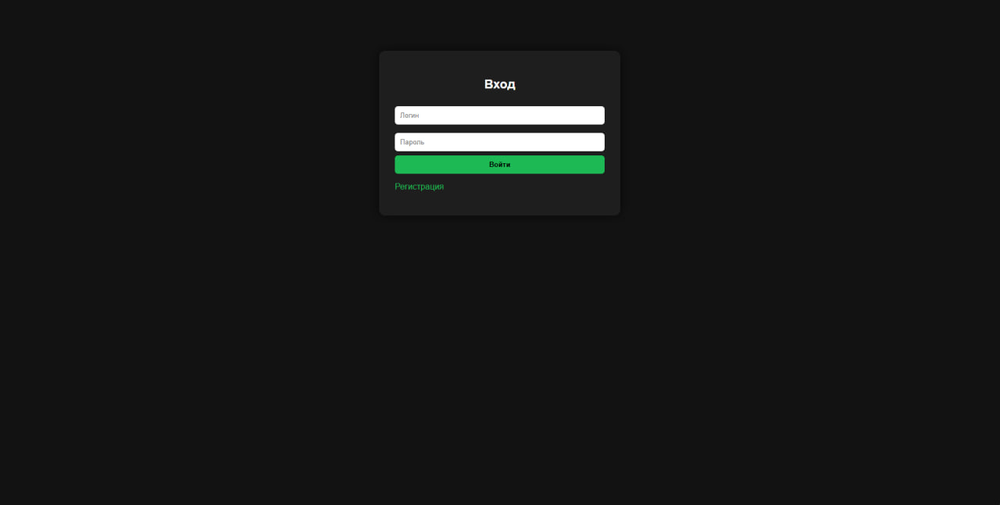
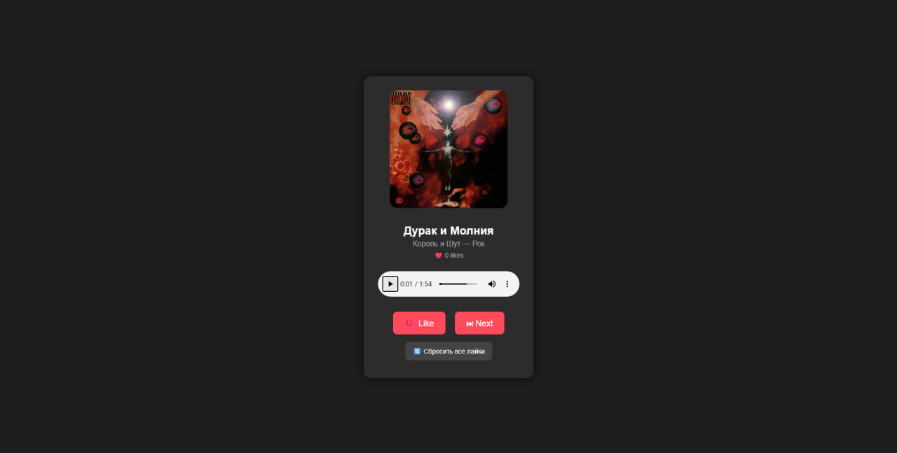
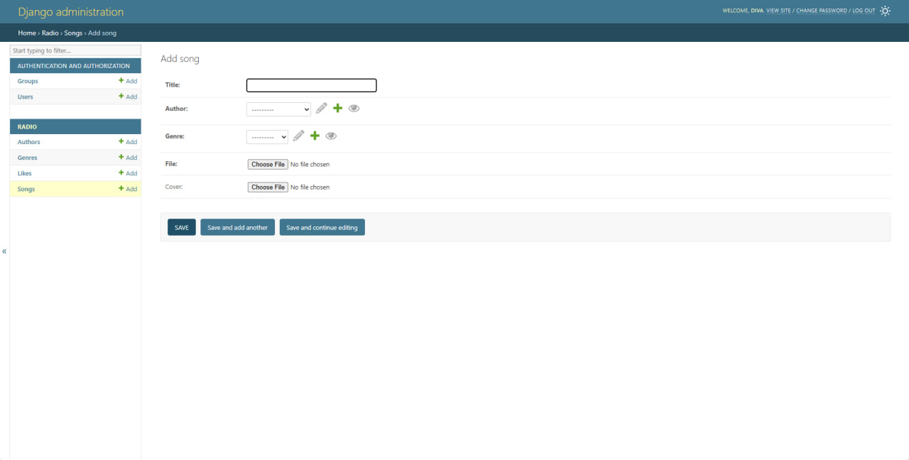
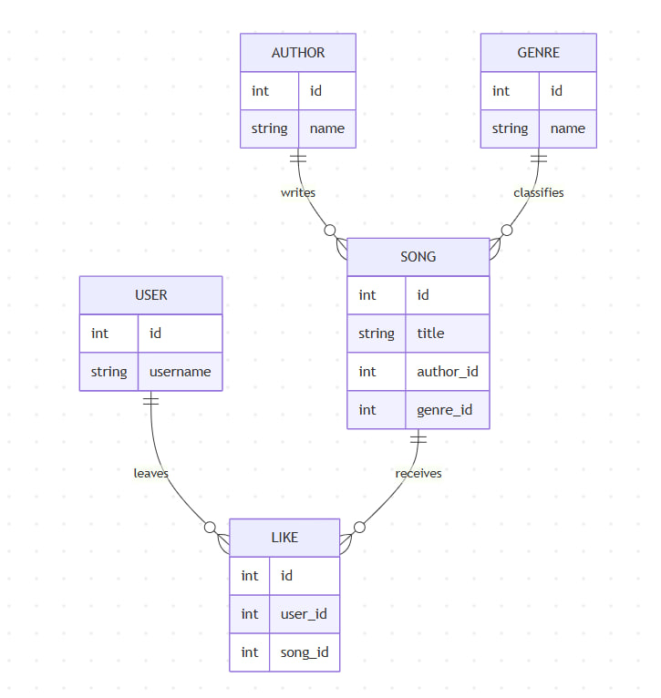

# My Radio — Персональное онлайн-радио с умными рекомендациями

**My Radio** — это веб-приложение на Django, реализующее бесконечное персонализированное радио.  
Система анализирует лайки пользователя и формирует плейлист: чаще играет любимые жанры и исполнителей, избегает частых повторений, автоматически переключает треки без перезагрузки страницы. Всё работает плавно благодаря AJAX и HTML5 Audio.

Проект создан в рамках учебной практики.

---

## Возможности (Features)

- Регистрация, вход и выход из аккаунта
- Бесконечное радио с автопереключением треков
- Лайки треков → влияют на рекомендации
- Умная система рекомендаций:
  - Приоритет трекам из любимых жанров и от любимых исполнителей
  - Каждый **4-й трек** — из «чужого» жанра/исполнителя (для разнообразия)
  - Трек, который только что играл или был лайкнут, **не появляется ближайшие 5 песен**
- Кнопка полного сброса всех лайков и истории рекомендаций
- Плавное воспроизведение без пауз и перезагрузок (seamless audio + AJAX)
- Удобная админ-панель: авторы и жанры выбираются из списков (не вводятся вручную)
- Минималистичный адаптивный дизайн

---

## Технологии (Tech Stack)

- **Backend**: Python 3.11+, Django 4.x
- **База данных**: SQLite (в продакшене легко заменить на PostgreSQL)
- **Frontend**: HTML5, CSS3, Vanilla JavaScript (без фреймворков)
- **Хранение медиа**: Django `FileField` и `ImageField`
- **Сессии**: Django sessions — для хранения истории прослушивания и рекомендаций

---

## Установка и запуск (Installation)

### 1. Клонирование репозитория
```bash
git clone https://github.com/ВАШ_ЮЗЕРНЕЙМ/my-radio.git
cd my-radio

2. Создание и активация виртуального окружения
python -m venv .venv
Linux / macOS:
source .venv/bin/activate
Windows:
.venv\Scripts\activate

3. Установка зависимостей
pip install -r requirements.txt

4. Применение миграций
python manage.py makemigrations
python manage.py migrate

5. Создание суперпользователя
python manage.py createsuperuser

6. Добавление контента через админку
python manage.py runserver
Перейдите в браузере по адресу: http://127.0.0.1:8000/admin/

Порядок добавления данных:

Genre (например: Rock, Pop, Electronic)
Author (например: The Beatles, Daft Punk)
Song — загрузите аудиофайл (.mp3), обложку и выберите автора + жанр

7. Запуск проекта
Bashpython manage.py runserver
Откройте в браузере: http://127.0.0.1:8000/
```
---

# Скриншоты (Screenshots)





# ER-диаграмма базы данных


# Модели базы данных
User

Стандартная модель Django auth.User.

Author

Исполнители треков.

Поле	Тип	Примечание
name	CharField	Имя исполнителя
Genre

Жанры музыки.

Поле	Тип	Примечание
name	CharField	Название жанра
Song

Треки.

Поле	Тип	Примечание
title	CharField	Название трека
author	ForeignKey(Author)	Исполнитель трека
genre	ForeignKey(Genre)	Жанр трека
file	FileField	Аудиофайл
cover	ImageField	Обложка (опционально)
Like

Лайки пользователей трекам.

Поле	Тип	Примечание
user	ForeignKey(User)	Пользователь
song	ForeignKey(Song)	Трек
Ограничение	unique_together	(user, song) — пользователь может лайкнуть трек только один раз

# 🌐 API-эндпоинты (AJAX)
### Метод	URL	Описание
GET	/next-song/?current_id=X	
### Получить данные следующего трека (JSON)
POST	/like/<int:song_id>/	
### Поставить лайк текущему треку
POST	/reset-likes/	
####Удалить все лайки и очистить историю рекомендаций

# 🏗 Архитектура проекта
Text Browser (HTML + CSS + Vanilla JS + <audio>)
        ↓↑ (AJAX: fetch)
Django Backend (views.py, models.py)
        ↓↑
SQLite БД (Song, Author, Genre, Like, User)
        ↑
Django Sessions ← хранение:
   • recently_played (последние 5 треков)
   • recently_liked (последние 5 лайкнутых)
   • track_counter

🔹 Принцип работы

Все действия пользователя (лайк, следующий трек) выполняются через AJAX.

Рекомендации рассчитываются на сервере с учётом лайков и истории сессии.

Аудиопоток меняется через audio.src без перезагрузки страницы.
